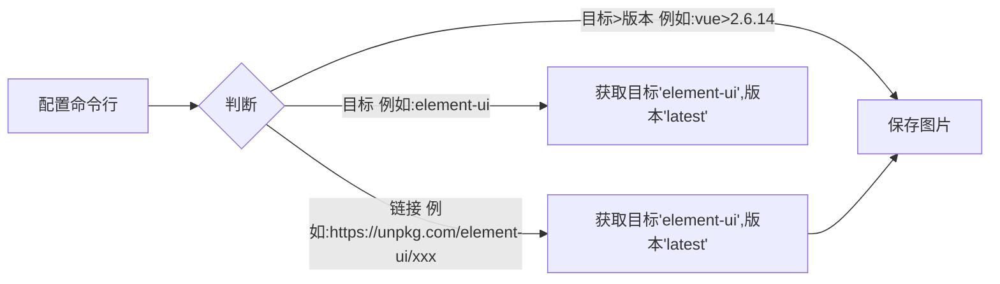
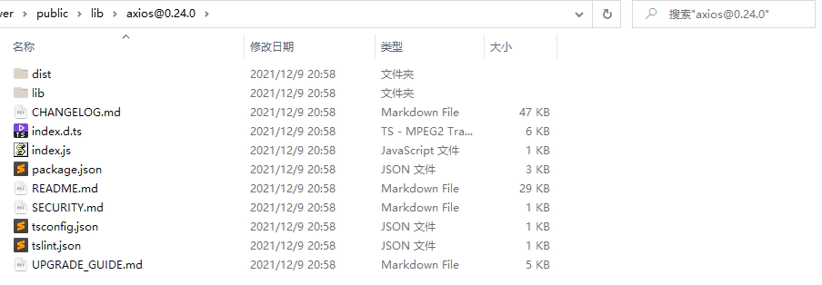

```
   __  __            __            ____                      __                __
  / / / /___  ____  / /______ _   / __ \____ _      ______  / /___  ____ _____/ /
 / / / / __ \/ __ \/ //_/ __ `/  / / / / __ \ | /| / / __ \/ / __ \/ __ `/ __  / 
/ /_/ / / / / /_/ / ,< / /_/ /  / /_/ / /_/ / |/ |/ / / / / / /_/ / /_/ / /_/ /  
\____/_/ /_/ .___/_/|_|\__, /  /_____/\____/|__/|__/_/ /_/_/\____/\__,_/\__,_/   
          /_/         /____/                                               By 六记
```

## Unpkg下载

### 原理

> 注释: > 自行提换成 @



```
usage: UnpkgDownload.exe [-h] [-o OUTPUT] -d DOWNLOAD [-v VERSION]

Unpkg.com下载工具 1. 理论上支持Unpkg.com所有的链接 2. 不支持多线程下载(防止过多请求)

optional arguments:
  -h, --help            show this help message and exit
  -o OUTPUT, --output OUTPUT
                        默认下载路径: ~/Downloads
  -d DOWNLOAD, --download DOWNLOAD
                        下载链接, 支持填写链接、填写目标(vue)、填写目标@版本(vue@2.6.14)
  -v VERSION, --version VERSION
                        下载版本, 不填写则默认最新
```

### 下载结果(文件预览)


