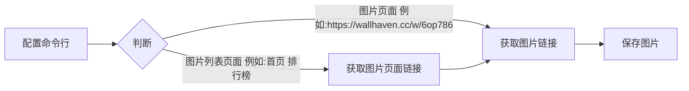
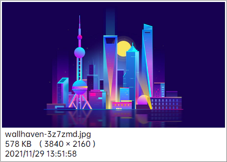
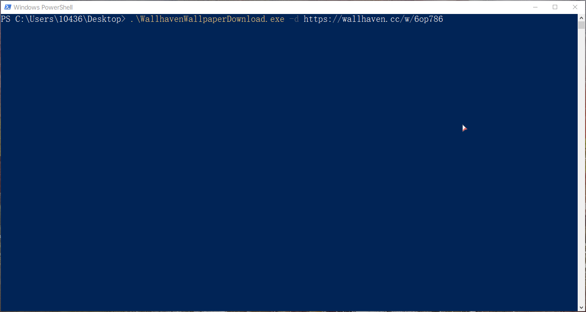
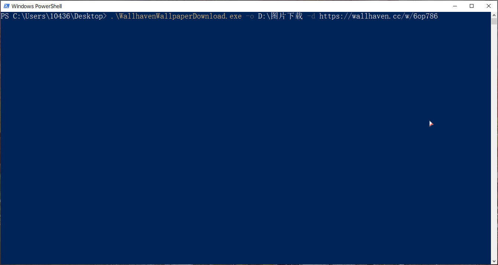

```
 __          __   _ _ _                            __          __   _ _
 \ \        / /  | | | |                           \ \        / /  | | |
  \ \  /\  / /_ _| | | |__   __ ___   _____ _ __    \ \  /\  / /_ _| | |_ __   __ _ _ __   ___ _ __
   \ \/  \/ / _` | | | '_ \ / _` \ \ / / _ \ '_ \    \ \/  \/ / _` | | | '_ \ / _` | '_ \ / _ \ '__|
    \  /\  / (_| | | | | | | (_| |\ V /  __/ | | |    \  /\  / (_| | | | |_) | (_| | |_) |  __/ |
     \/  \/ \__,_|_|_|_| |_|\__,_| \_/ \___|_| |_|     \/  \/ \__,_|_|_| .__/ \__,_| .__/ \___|_|
                                                                       | |         | |
                                                                       |_|         |_|       By 六记
```

## Wallhaven壁纸下载

### 原理




```
usage: WallhavenWallpaperDownload.exe [-h] [-o OUTPUT] -d DOWNLOAD

Wallhaven壁纸下载工具 1. 理论上支持Wallhaven.cc所有的链接 2. 不支持多线程下载(防止过多请求)

optional arguments:
  -h, --help            show this help message and exit
  -o OUTPUT, --output OUTPUT
                        输出路径(默认: C:\Users\10436\Pictures\下载)
                        支持回复: 
                          A: C:\Users\10436\Desktop[桌面路径]
                          B: C:\Users\10436\Pictures[图片路径]
  -d DOWNLOAD, --download DOWNLOAD
                        下载链接
```

### 下载结果(图片文件预览)



### 使用方法

1. 不指定下载路径

    

2. 指定下载路径

    
